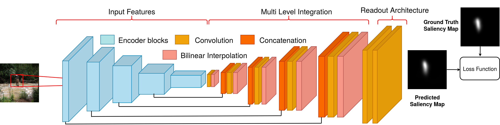
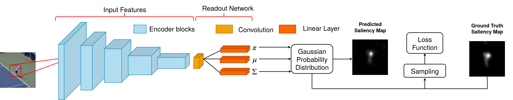
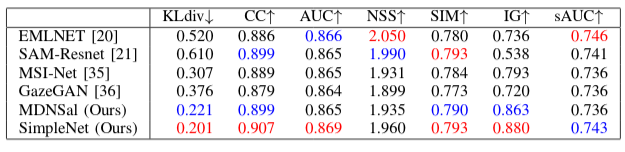
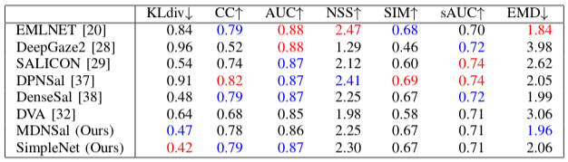

# Tidying Deep Saliency Prediction Architectures

This repository contains Pytorch Implementation of SimpleNet and MDNSal. 

## Cite
Please cite with the following Bibtex code:
```
@misc{reddy2020tidying,
    title={Tidying Deep Saliency Prediction Architectures},
    author={Navyasri Reddy and Samyak Jain and Pradeep Yarlagadda and Vineet Gandhi},
    year={2020},
    eprint={2003.04942},
    archivePrefix={arXiv},
    primaryClass={cs.CV}
}

```
## Abstract

Learning computational models for visual attention (saliency estimation) is an effort to inch machines/robots closer to human visual cognitive abilities. Data-driven efforts have dominated the landscape since the introduction of deep neural network architectures. In deep learning research, the choices in architecture design are often empirical and frequently lead to more complex models than necessary. The complexity, in turn, hinders the application requirements. In this paper, we identify four key components of saliency models, i.e., input features,  multi-level integration, readout architecture, and loss functions. We review the existing state of the art models on these four components and propose novel and simpler alternatives. As a result, we propose two novel end-to-end architectures called SimpleNet and MDNSal, which are neater, minimal, more interpretable and achieve state of the art performance on public saliency benchmarks. SimpleNet is an optimized encoder-decoder architecture and brings notable performance gains on the SALICON dataset (the largest saliency benchmark). MDNSal is a parametric model that directly predicts parameters of a GMM distribution and is aimed to bring more interpretability to the prediction maps. The proposed saliency models run at 25fps, making them ideal for real-time applications.

## Architecture
SimpleNet Architecture


MDNSal Architecture

## Testing
Clone this repository and download the pretrained weights of SimpleNet, for multiple encoders, trained on SALICON dataset from this [link](https://iiitaphyd-my.sharepoint.com/:u:/g/personal/samyak_j_research_iiit_ac_in/Eddzj58KvrhFtb6XinOFkhMBn8uFapCnOM6Ia0K1jFJhqw).

Then just run the code using 
```bash
$ python3 test.py --val_img_dir path/to/test/images --results_dir path/to/results --model_val_path path/to/saved/models
```
This will generate saliency maps for all images in the images directory and dump these maps into results directory

## Training
For training the model from scratch, download the pretrained weights of PNASNet from [here](https://iiitaphyd-my.sharepoint.com/:u:/g/personal/samyak_j_research_iiit_ac_in/ERpsc82shFJNhtn-xfRr69ABCHtJNUlSHkSc99srArDtQQ?e=VIabCg) and place these weights in the PNAS/ folder. Run the following command to train 

```bash
$ python3 train.py --dataset_dir path/to/dataset 
```
The dataset directory structure should be 
```
└── Dataset  
    ├── fixations  
    │   ├── train  
    │   └── val  
    ├── images  
    │   ├── train  
    │   └── val  
    ├── maps  
        ├── train  
        └── val  
```

For training the model with MIT1003 or CAT2000 dataset, first train the model with SALICON dataset and finetune the model weights on MIT1003 or CAT2000 dataset.
## Experiments

* ### Multiple Encoders
For training the model, we provide encoders based out of PNASNet, DenseNet-161, VGG-16 and ResNet-50. Run the command - 
```bash
$ python3 train.py --enc_model <model> --train_enc <boolean value> 
<model> : {"pnas", "densenet", "resnet", "vgg"}
```
train_enc is 1 if we want to finetune the encoder and 0 otherwise.

Similarly for testing the model,
```bash
$ python3 test.py --enc_model <model> --model_val_path path/to/pretrained/model 
```

* ### Multiple Loss functions
For the training the model with a combination of loss functions, run the following command -
```bash
$ python3 train.py --<loss_function> True --<loss_function>_coeff <coefficient of the loss>
<loss_function> : {"kldiv", "cc", "nss", "sim"}
```
By default the loss function is KLDiv with coefficient 1.0

## Quantitative Results

* ### SALICON Test
The results of our models on SALICON test dataset can be viewed [here](https://competitions.codalab.org/competitions/17136#results) under the name SimpleNet and MDNSal. Comparison with other state-of-the-art saliency detection models 


* ### MIT Test
Comparison with other state-of-the-art saliency detection models on MIT300 test set

## Qualitative Results

## Contact 
If any question, please contact samyak.j@research.iiit.ac.in, navyasri.reddy@research.iiit.ac.in or pradeep.yarlagadda@students.iiit.ac.in , or use public issues section of this repository

## License 
This code is distributed under MIT LICENSE.
